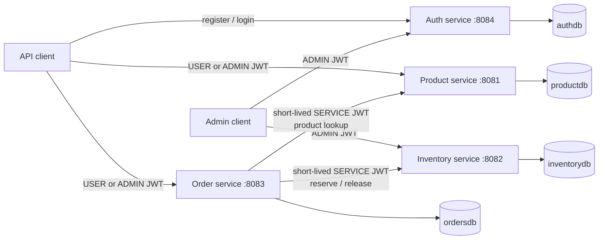

# E-commerce microservices POC

A runnable Java 21 / Spring Boot 4 proof of concept with authentication, role-based access control, independent H2 databases, synchronous order orchestration, global RFC 9457 error responses, AOP logging, and Resilience4j fault tolerance.

No automated tests are included. The [requests.http](requests.http) collection and the manual checks below exercise the complete flow.

## Architecture



Each service owns its data. There are no cross-database foreign keys or shared JPA entities.

| Module | Port | Responsibility |
| --- | ---: | --- |
| `platform-common` | n/a | Shared JWT validation, Problem Details, correlation IDs, and logging aspect |
| `auth-service` | 8084 | Registration, login, JWT issuing, and user administration |
| `product-service` | 8081 | Product catalog and authoritative prices |
| `inventory-service` | 8082 | Available/reserved stock and atomic reservations |
| `order-service` | 8083 | Owned-order APIs, orchestration, compensation, and downstream fault tolerance |

## Security model

All services validate HS256 tokens with the same issuer, audience, and secret. `JWT_SECRET` is mandatory and must contain at least 32 UTF-8 bytes. Never commit a real secret.

- `USER` can browse products and create, list, view, or cancel only their own orders.
- `ADMIN` can manage products, inventory, and users, and can view or cancel every order.
- `SERVICE` is internal only. The order service creates a 60-second token for catalog lookup and inventory reservation/release. It includes the initiating user's subject as the actor claim for traceability.
- Registration always creates an enabled `USER`; only an admin can change a role or enabled state.
- Passwords are BCrypt-hashed. Access tokens expire after 15 minutes by default. There are deliberately no refresh tokens in this POC.
- Anonymous requests receive `401`; authenticated callers without the required role receive `403`.

HS256 is suitable for this contained POC. A production system should prefer a dedicated identity provider and asymmetric signing or a managed key service, plus proper machine identity rather than sharing a symmetric signing key among services.

## Configure the environment

Copy the example file and set a random secret of at least 32 bytes:

```powershell
Copy-Item .env.example .env
```

```bash
cp .env.example .env
```

Edit `.env` and populate `JWT_SECRET`. For example, generate 48 random bytes with `openssl rand -base64 48`. Docker Compose reads `.env` automatically. The file is gitignored; `.env.example` is safe to commit because it contains no JWT secret.

The default seeded accounts are for local development only:

| Role | Email | Password |
| --- | --- | --- |
| `ADMIN` | `admin@example.com` | `ChangeMeAdmin123!` |
| `USER` | `user@example.com` | `ChangeMeUser123!` |

Change or disable these values outside local development. The auth seed is idempotent and never overwrites an existing user's password.

## Run with Docker Compose

Prerequisites: Docker with Compose v2.

```bash
docker compose up --build --wait
```

Compose refuses to resolve while `JWT_SECRET` is absent or empty. It injects the same JWT settings into every service and Docker-network URLs into the order service.

Verify health:

```bash
curl http://localhost:8081/actuator/health
curl http://localhost:8082/actuator/health
curl http://localhost:8083/actuator/health
curl http://localhost:8084/actuator/health
```

Stop the stack and remove the in-memory data:

```bash
docker compose down
```

## Run with Gradle

Prerequisite: JDK 21. The Gradle wrapper is included.

Build all bootable JARs:

```powershell
.\gradlew.bat clean bootJar --no-daemon
```

Before starting each service, export the same `JWT_SECRET`, `JWT_ISSUER`, and `JWT_AUDIENCE` in every terminal. Start the auth service with the documented seed explicitly enabled:

```powershell
$env:JWT_SECRET = '<the-same-random-secret-of-at-least-32-bytes>'
$env:JWT_ISSUER = 'ecommerce-auth'
$env:JWT_AUDIENCE = 'ecommerce-api'
$env:AUTH_SEED_ENABLED = 'true'
$env:AUTH_ADMIN_EMAIL = 'admin@example.com'
$env:AUTH_ADMIN_PASSWORD = 'ChangeMeAdmin123!'
$env:AUTH_USER_EMAIL = 'user@example.com'
$env:AUTH_USER_PASSWORD = 'ChangeMeUser123!'
.\gradlew.bat :auth-service:bootRun
```

In three additional terminals, set the same JWT variables and run one command per terminal:

```powershell
.\gradlew.bat :product-service:bootRun
.\gradlew.bat :inventory-service:bootRun
.\gradlew.bat :order-service:bootRun
```

Product and inventory seed matching demo SKUs by default. Open [requests.http](requests.http) in IntelliJ IDEA and execute it from top to bottom for the normal user/admin workflow.

## API and authorization overview

| Service | Method and path | Allowed caller | Purpose |
| --- | --- | --- | --- |
| Auth | `POST /api/auth/register` | Public | Register an enabled `USER` |
| Auth | `POST /api/auth/login` | Public | Obtain a bearer access token |
| Auth | `GET /api/users/me` | `USER`, `ADMIN` | Read the authenticated profile |
| Auth | `GET /api/admin/users?page=0&size=20` | `ADMIN` | Page through users |
| Auth | `PATCH /api/admin/users/{id}/role` | `ADMIN` | Set `USER` or `ADMIN` role |
| Auth | `PATCH /api/admin/users/{id}/enabled` | `ADMIN` | Enable or disable an account |
| Auth | `DELETE /api/admin/users/{id}` | `ADMIN` | Delete an account |
| Product | `GET /api/products` | `USER`, `ADMIN` | List products |
| Product | `GET /api/products/{id}` | `USER`, `ADMIN` | Get a product by id |
| Product | `GET /api/products/sku/{sku}` | `USER`, `ADMIN`, internal `SERVICE` | Get a product by SKU |
| Product | `POST /api/products` | `ADMIN` | Create a product |
| Product | `PUT /api/products/{id}` | `ADMIN` | Replace a product |
| Product | `DELETE /api/products/{id}` | `ADMIN` | Delete a product |
| Inventory | `GET /api/inventory` | `ADMIN` | List stock records |
| Inventory | `GET /api/inventory/{sku}` | `ADMIN` | Get stock by SKU |
| Inventory | `POST /api/inventory` | `ADMIN` | Create a stock record |
| Inventory | `PUT /api/inventory/{sku}` | `ADMIN` | Set available stock |
| Inventory | `POST /api/inventory/{sku}/reservations` | Internal `SERVICE` | Atomically reserve stock |
| Inventory | `DELETE /api/inventory/{sku}/reservations?quantity=N` | Internal `SERVICE` | Release reserved stock |
| Order | `POST /api/orders` | `USER`, `ADMIN` | Price, reserve, and create an order |
| Order | `GET /api/orders` | `USER` own / `ADMIN` all | List visible orders |
| Order | `GET /api/orders/{id}` | Owner or `ADMIN` | Get an order |
| Order | `POST /api/orders/{id}/cancel` | Owner or `ADMIN` | Release stock and cancel an order |

The client does not submit a customer email or prices when creating an order. Identity comes from the validated JWT, and prices come from the product service.

## How to test manually

Use [requests.http](requests.http) for the quickest path. These are the important checks and expected results:

1. Login as both seeded accounts: `POST /api/auth/login` returns `200` and a bearer token.
2. Call `GET /api/products` without a token: expect `401 application/problem+json`.
3. Call `GET /api/products` with the user token: expect `200`.
4. Create a product with the user token: expect `403`; repeat with the admin token: expect `201`.
5. Read or mutate inventory with the user token: expect `403`; the admin token can manage stock.
6. Place an order with the user token and only `items` in the body: expect `201`. The response's customer identity must match the JWT, not client input.
7. List orders with the user token: only that user's orders appear. The admin token sees all orders.
8. Cancel the order as its owner or an admin: expect `200`, `CANCELLED` status, and released inventory. Repeating cancellation is safe and returns the existing cancelled order.
9. Send an empty `items` array: expect `400 application/problem+json` with `code`, `detail`, `instance`, `timestamp`, and `correlationId`.
10. Send `X-Correlation-ID: manual-order-001` when creating an order. The response echoes it, and the same value appears in order, product, and inventory logs.

To inspect correlation across Compose logs:

```powershell
docker compose logs order-service product-service inventory-service | Select-String 'manual-order-001'
```

### Fault-tolerance check

Catalog reads have a bounded exponential retry, circuit breaker, connect/read timeouts, and bulkhead. Inventory mutations intentionally are not retried, because blindly retrying a non-idempotent reservation could reserve twice; they still have a circuit breaker, timeouts, and bulkhead.

1. Stop the catalog: `docker compose stop product-service`.
2. Submit an order repeatedly. Initial downstream failures return `502`; after the configured failure threshold opens the breaker, requests fail fast with `503` and `code: downstream_capacity_exhausted`.
3. Inspect breaker state with an admin token: `GET http://localhost:8083/actuator/circuitbreakers`.
4. Restart the catalog: `docker compose start product-service`.
5. After the 10-second open-state wait and successful half-open calls, the breaker closes and order creation succeeds again.

Capacity rejection also returns `503`. Business failures stay distinct: unavailable products return `422`, insufficient inventory returns `409`, and unexpected downstream HTTP/network failures return `502`.

## Errors, logging, and observability

- All services return consistent `application/problem+json` bodies for validation, authentication, authorization, domain, and unexpected errors. Internal stack traces and secrets are not exposed.
- `X-Correlation-ID` is accepted when it is safe, otherwise generated; it is returned to the caller, stored in the logging MDC, and propagated through the order workflow.
- The shared Spring AOP aspect logs controller/service entry, exit, duration, failure type, authenticated subject, internal actor subject, and correlation ID. It does not log bearer tokens, passwords, request bodies, or method argument values.
- Health endpoints are public. Other exposed order-service actuator endpoints require `ADMIN`.

## H2 development databases

All four databases are in memory, so data resets when a service stops. Product and inventory demo records are seeded idempotently. Set `PRODUCT_SEED_ENABLED=false`, `INVENTORY_SEED_ENABLED=false`, or `AUTH_SEED_ENABLED=false` to disable the corresponding seed.

The development H2 consoles for product, inventory, and order are at `/h2-console` on each service port. The auth console is disabled by default; set `H2_CONSOLE_ENABLED=true` only when it is needed locally. Use username `sa`, a blank password, and the matching JDBC URL:

| Service | JDBC URL |
| --- | --- |
| Auth (console disabled by default) | `jdbc:h2:mem:authdb` |
| Product | `jdbc:h2:mem:productdb` |
| Inventory | `jdbc:h2:mem:inventorydb` |
| Order | `jdbc:h2:mem:ordersdb` |

The H2 console and automatic schema updates are development conveniences. Disable the console and use versioned migrations in deployed environments.

## Order consistency model

Order creation is a small synchronous saga:

1. Look up each product and use its current catalog price.
2. Reserve each requested SKU with the inventory service.
3. Persist a confirmed order only after every reservation succeeds.
4. If a later reservation or persistence step fails, release all earlier reservations on a best-effort basis.

Cancellation takes a database write lock on the order, so concurrent cancel requests cannot release the same reservation twice.

This is not a distributed transaction. A production evolution should add idempotency keys, a transactional outbox, durable events, reservation identifiers, reconciliation, and observability that survives process restarts.

## Moving from H2 to MySQL

The domain and repository code uses standard JPA mappings, so the main change is infrastructure and configuration:

1. Add `com.mysql:mysql-connector-j` as a runtime dependency to each persistence service.
2. Configure each service's datasource URL, username, and password for its own MySQL schema.
3. Replace `ddl-auto=update` with Flyway or Liquibase migrations and validate the schema on startup.
4. Keep separate schemas and credentials so each service retains ownership of its data.
5. Review transaction isolation, connection-pool sizing, indexes, timeouts, backups, and secret delivery for the target environment.

Catalog and inventory locations are already externalized as `CLIENTS_CATALOG_BASE_URL` and `CLIENTS_INVENTORY_BASE_URL`.
