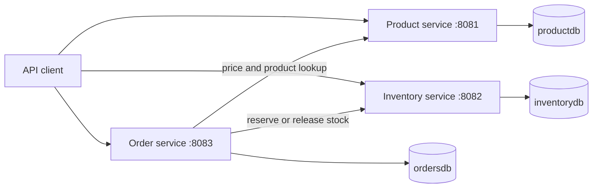

# E-commerce microservices POC

A small, runnable e-commerce backend built with Java 21, Spring Boot, Gradle, and one H2 database per service. It demonstrates independent persistence, synchronous service-to-service calls, server-authoritative pricing, inventory reservation, and compensating actions.

## Architecture



Each service owns its data. There are no cross-database foreign keys or shared JPA entities.

| Service | Port | Responsibility |
| --- | ---: | --- |
| `product-service` | 8081 | Product catalog and authoritative prices |
| `inventory-service` | 8082 | Available/reserved stock and atomic reservations |
| `order-service` | 8083 | Order orchestration, totals, and cancellation |

## Run locally

Prerequisite: JDK 21. The Gradle wrapper is included.

Build everything:

```powershell
.\gradlew.bat clean bootJar
```

Then start each service in its own terminal:

```powershell
.\gradlew.bat :product-service:bootRun
.\gradlew.bat :inventory-service:bootRun
.\gradlew.bat :order-service:bootRun
```

The catalog and inventory services seed matching demo SKUs on startup. Open [requests.http](requests.http) in IntelliJ IDEA to exercise a complete order flow, or create an order directly:

```bash
curl -X POST http://localhost:8083/api/orders \
  -H "Content-Type: application/json" \
  -d '{"customerEmail":"buyer@example.com","items":[{"sku":"SKU-LAPTOP","quantity":1}]}'
```

Actuator health endpoints are available at `/actuator/health` on every service.

## Run with Docker Compose

```bash
docker compose up --build
```

Compose injects Docker-network URLs into the order service; no source change is needed. Stop the stack with `docker compose down`.

## API overview

| Method and path | Purpose |
| --- | --- |
| `GET /api/products` | List catalog products |
| `GET /api/products/{id}` | Find a product by id |
| `GET /api/products/sku/{sku}` | Find a product by SKU |
| `POST /api/products` | Create a product |
| `PUT /api/products/{id}` | Replace a product |
| `DELETE /api/products/{id}` | Delete a product |
| `GET /api/inventory` | List stock records |
| `GET /api/inventory/{sku}` | Find stock by SKU |
| `POST /api/inventory` | Create a stock record |
| `PUT /api/inventory/{sku}` | Update available stock |
| `POST /api/inventory/{sku}/reservations` | Reserve a quantity |
| `DELETE /api/inventory/{sku}/reservations?quantity=N` | Release a quantity |
| `GET /api/orders` | List orders |
| `GET /api/orders/{id}` | Find an order |
| `POST /api/orders` | Validate, reserve, and create an order |
| `POST /api/orders/{id}/cancel` | Release stock and cancel an order |

Request validation and operational failures use `application/problem+json` responses. In particular, insufficient inventory returns HTTP 409.

SKUs are 1–64 characters, start with a letter or number, and may contain letters, numbers, `.`, `_`, or `-`. All services normalize them to uppercase.

## H2 development databases

All three databases are in memory, so data resets when a service stops. Product and inventory demo records are seeded idempotently. Set `PRODUCT_SEED_ENABLED=false` and `INVENTORY_SEED_ENABLED=false` to disable them.

The H2 consoles are at `/h2-console` on each service port. Use username `sa`, a blank password, and the matching JDBC URL:

| Service | JDBC URL |
| --- | --- |
| Product | `jdbc:h2:mem:productdb` |
| Inventory | `jdbc:h2:mem:inventorydb` |
| Order | `jdbc:h2:mem:ordersdb` |

## Order consistency model

Order creation is a small synchronous saga:

1. Look up each product and take its current catalog price.
2. Reserve each requested SKU with the inventory service.
3. Persist a confirmed order only after every reservation succeeds.
4. If a later reservation or persistence step fails, release all earlier reservations on a best-effort basis.

This is intentionally a POC, not a distributed transaction. A production evolution should use idempotency keys, an outbox, durable events, retries, and reconciliation for failures that outlive a process.

## Moving from H2 to MySQL

The domain and repository code uses standard JPA types, so the switch is configuration-focused:

1. Add `com.mysql:mysql-connector-j` as a runtime dependency to each service.
2. Set each service's `SPRING_DATASOURCE_URL`, `SPRING_DATASOURCE_USERNAME`, and `SPRING_DATASOURCE_PASSWORD` to its own MySQL schema.
3. Set the Hibernate dialect/DDL policy appropriate for the environment; prefer Flyway or Liquibase migrations outside local development.
4. Keep separate schemas (and separate credentials) so service ownership remains intact.

Service locations are already externalized as `CLIENTS_CATALOG_BASE_URL` and `CLIENTS_INVENTORY_BASE_URL`.
