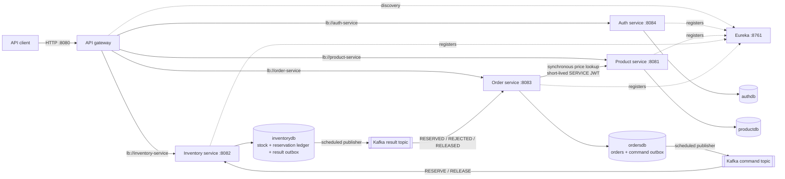

# E-commerce microservices POC

A runnable Java 21 / Spring Boot 4 proof of concept with a Eureka-backed API gateway, JWT role-based access control, service-owned H2 databases, and a Kafka event-driven inventory workflow. Catalog pricing is synchronous; inventory reservation and release are asynchronous and use transactional outboxes.

Automated tests cover the event contracts, gateway correlation IDs, inventory command idempotency, and the order inventory state machine. The [requests.http](requests.http) collection exercises the end-to-end API through the gateway.

## Architecture



The gateway and all four business services register with Eureka. The gateway resolves its `lb://` routes from the registry, and the order service resolves `http://product-service` through the same Spring Cloud load balancer. Each persistence service owns its data; there are no cross-database foreign keys or shared JPA entities.

In Docker Compose, only the edge and infrastructure ports are published to the host:

| Component | Compose address | Host address | Responsibility |
| --- | --- | --- | --- |
| API gateway | `api-gateway:8080` | `http://localhost:8080` | External HTTP entry point, routing, CORS, and correlation IDs |
| Eureka | `eureka-server:8761` | `http://localhost:8761` | Service registry and development dashboard |
| Kafka | `kafka:19092` | `localhost:9092` | Inventory commands, results, and dead-letter topics |
| Auth service | `auth-service:8084` | not published | Registration, login, JWT issuing, and user administration |
| Product service | `product-service:8081` | not published | Product catalog and authoritative prices |
| Inventory service | `inventory-service:8082` | not published | Stock management, command consumer, and reservation ledger |
| Order service | `order-service:8083` | not published | Order APIs, catalog client, command outbox, and result consumer |
| `event-contracts` | n/a | n/a | Versioned, dependency-free inventory event records and topic names |
| `platform-common` | n/a | n/a | Shared JWT validation, Problem Details, correlation IDs, and logging |

The service ports are still used when running the applications directly with Gradle, but clients should treat gateway port `8080` as the API contract.

## Order and inventory workflow

Creating an order is deliberately hybrid:

1. The order service synchronously reads each current price from the product service. This call is service-discovered, timeout-bounded, retried, bulkheaded, protected by the `catalog` circuit breaker, and authenticated with a 60-second `SERVICE` JWT.
2. One order transaction stores the priced order as `PENDING_INVENTORY` and its `RESERVE` command in `order_outbox_events`.
3. `POST /api/orders` returns `202 Accepted`, the pending representation, and `Location: /api/orders/{id}`. The client polls that location rather than assuming inventory is already reserved.
4. The order outbox publisher sends the command to `ecommerce.inventory.commands.v1`, keyed by order ID.
5. The inventory consumer locks stock, atomically updates stock and a per-order reservation ledger, and stores its result in `inventory_outbox_events`.
6. The inventory outbox publisher sends `RESERVED` or `REJECTED` to `ecommerce.inventory.results.v1`. The order consumer then moves the order to `CONFIRMED` or `REJECTED`.

Cancellation follows the same path with sequence `2`: the order moves to `CANCELLATION_PENDING`, a `RELEASE` command is published, and a matching `RELEASED` result moves it to `CANCELLED`.

| Current status | Trigger | Next status | HTTP behavior |
| --- | --- | --- | --- |
| new order | accepted after catalog pricing | `PENDING_INVENTORY` | create returns `202` |
| `PENDING_INVENTORY` | `RESERVED` result, sequence 1 | `CONFIRMED` | visible on a later `GET` |
| `PENDING_INVENTORY` | `REJECTED` result, sequence 1 | `REJECTED` | `statusReason` explains the inventory failure |
| `PENDING_INVENTORY`, `CONFIRMED`, or `REJECTED` | cancellation requested | `CANCELLATION_PENDING` | cancel returns `202` |
| `CANCELLATION_PENDING` | `RELEASED` result, sequence 2 | `CANCELLED` | visible on a later `GET` |
| `CANCELLED` | cancellation repeated | `CANCELLED` | cancel returns `200` without another command |

The outbox publishers provide at-least-once delivery: a send that succeeds just before a database rollback can be sent again. The inventory reservation ledger is keyed by order ID and records the last sequence, last command, state, and lines, so duplicate or older commands cannot reserve or release stock twice. Order transitions also check the expected state and sequence. Records that still fail after three one-second retries are sent to the corresponding `.dlt` topic. Those records require operational replay or reconciliation; the related order remains pending until that happens.

If Kafka is temporarily unavailable after an order is accepted, its command remains in the order outbox and the order remains pending until publishing succeeds. In this POC the databases are in-memory H2, so the pattern is transactional but not durable across a service restart; use durable service-owned databases in a deployed system.

## Configure the environment

Copy the example file and set a random JWT secret containing at least 32 UTF-8 bytes:

```powershell
Copy-Item .env.example .env
```

```bash
cp .env.example .env
```

Generate a value with a tool such as `openssl rand -base64 48`, then put it in `JWT_SECRET`. Docker Compose reads `.env` automatically and refuses to resolve the stack while the secret is empty. The file is gitignored; `.env.example` contains no real secret.

`GATEWAY_CORS_ALLOWED_ORIGIN_PATTERN` defaults to local browser origins. Restrict it to the actual frontend origin outside local development.

The seeded accounts are for local development only:

| Role | Email | Password |
| --- | --- | --- |
| `ADMIN` | `admin@example.com` | `ChangeMeAdmin123!` |
| `USER` | `user@example.com` | `ChangeMeUser123!` |

The auth seed is idempotent and never overwrites an existing user's password. Change or disable all demo credentials outside local development.

## Run with Docker Compose

Prerequisite: Docker with Compose v2.

```bash
docker compose up --build --wait
```

If host port `8080` is already occupied, set `GATEWAY_HOST_PORT=18080` in `.env` and use that port for gateway requests.

Use the gateway for every application request. Eureka and Kafka are exposed only for local inspection and tooling.

```bash
curl http://localhost:8080/actuator/health
curl http://localhost:8761/actuator/health
docker compose ps
docker compose exec kafka /opt/kafka/bin/kafka-topics.sh --bootstrap-server localhost:19092 --list
```

The Eureka dashboard is at [http://localhost:8761](http://localhost:8761). After startup it should show `API-GATEWAY`, `AUTH-SERVICE`, `PRODUCT-SERVICE`, `INVENTORY-SERVICE`, and `ORDER-SERVICE` instances.

Backend actuator and H2 endpoints are not routed by the gateway or published to the host. Inspect one from inside its container when needed:

```bash
docker compose exec order-service curl --fail --silent http://localhost:8083/actuator/health
```

Open [requests.http](requests.http) in IntelliJ IDEA and run it from top to bottom for the normal user/admin and asynchronous order workflow.

Stop the stack with:

```bash
docker compose down
```

This POC defines no named durable volumes. Treat the in-memory H2 databases and local Kafka data as disposable; a normal stack recreation does not restore them.

## Run locally with Gradle

Prerequisites: JDK 21 and Docker for the local Kafka broker. The Gradle wrapper is included.

Build and run all automated tests:

```powershell
.\gradlew.bat clean build --no-daemon
```

On Unix-like systems use `./gradlew` in place of `.\gradlew.bat`.

First create `.env` as described above, then start just Kafka from Compose:

```powershell
docker compose up -d --wait kafka
```

Start Eureka in its own terminal:

```powershell
.\gradlew.bat :eureka-server:bootRun
```

For each of the auth, product, inventory, and order service terminals, set the same JWT values before running the service command:

```powershell
$env:JWT_SECRET = '<the-same-random-secret-of-at-least-32-bytes>'
$env:JWT_ISSUER = 'ecommerce-auth'
$env:JWT_AUDIENCE = 'ecommerce-api'
```

Also enable the demo users in the auth terminal:

```powershell
$env:AUTH_SEED_ENABLED = 'true'
$env:AUTH_ADMIN_EMAIL = 'admin@example.com'
$env:AUTH_ADMIN_PASSWORD = 'ChangeMeAdmin123!'
$env:AUTH_USER_EMAIL = 'user@example.com'
$env:AUTH_USER_PASSWORD = 'ChangeMeUser123!'
```

Run one command per additional terminal, and start the gateway after the services have registered:

```powershell
.\gradlew.bat :auth-service:bootRun
.\gradlew.bat :product-service:bootRun
.\gradlew.bat :inventory-service:bootRun
.\gradlew.bat :order-service:bootRun
.\gradlew.bat :api-gateway:bootRun
```

The local defaults use Eureka at `http://localhost:8761/eureka/`, Kafka at `localhost:9092`, and the catalog service ID at `http://product-service`. Override `EUREKA_SERVER_URL`, `KAFKA_BOOTSTRAP_SERVERS`, or `CLIENTS_CATALOG_BASE_URL` only when those dependencies run elsewhere.

## Gateway routes and API authorization

All paths below are called through `http://localhost:8080`. The gateway preserves the `Authorization` header but does not authenticate it; the destination service validates the JWT and enforces authorization.

| Gateway path | Destination |
| --- | --- |
| `/api/auth/**`, `/api/users/**`, `/api/admin/**` | `auth-service` |
| `/api/products/**` | `product-service` |
| `/api/inventory/**` | `inventory-service` |
| `/api/orders/**` | `order-service` |

| API | Allowed caller | Purpose |
| --- | --- | --- |
| `POST /api/auth/register` | Public | Register an enabled `USER` (`201`) |
| `POST /api/auth/login` | Public | Obtain a bearer access token (`200`) |
| `GET /api/users/me` | `USER`, `ADMIN` | Read the authenticated profile |
| `GET /api/admin/users?page=0&size=20` | `ADMIN` | Page through users |
| `PATCH /api/admin/users/{id}/role` | `ADMIN` | Set `USER` or `ADMIN` role |
| `PATCH /api/admin/users/{id}/enabled` | `ADMIN` | Enable or disable an account |
| `DELETE /api/admin/users/{id}` | `ADMIN` | Delete an account (`204`) |
| `GET /api/products` | `USER`, `ADMIN` | List products |
| `GET /api/products/{id}` | `USER`, `ADMIN` | Get a product by ID |
| `GET /api/products/sku/{sku}` | `USER`, `ADMIN`, internal `SERVICE` | Get a product by SKU |
| `POST /api/products` | `ADMIN` | Create a product (`201`) |
| `PUT /api/products/{id}` | `ADMIN` | Replace a product |
| `DELETE /api/products/{id}` | `ADMIN` | Delete a product (`204`) |
| `GET /api/inventory` | `ADMIN` | List stock records |
| `GET /api/inventory/{sku}` | `ADMIN` | Get stock by SKU |
| `POST /api/inventory` | `ADMIN` | Create a stock record (`201`) |
| `PUT /api/inventory/{sku}` | `ADMIN` | Set available stock |
| `POST /api/inventory/{sku}/reservations` | Internal `SERVICE` | Compatibility endpoint for a direct reservation |
| `DELETE /api/inventory/{sku}/reservations?quantity=N` | Internal `SERVICE` | Compatibility endpoint for a direct release |
| `POST /api/orders` | `USER`, `ADMIN` | Price and accept an order asynchronously (`202`) |
| `GET /api/orders` | `USER` own / `ADMIN` all | List visible orders |
| `GET /api/orders/{id}` | Owner or `ADMIN` | Read an order and its current state |
| `POST /api/orders/{id}/cancel` | Owner or `ADMIN` | Request async release (`202`), or return an existing `CANCELLED` order (`200`) |

The order service does not call the direct inventory reservation endpoints; normal order reservation and release use Kafka. Clients do not submit customer identity or prices. Identity comes from the validated JWT, and unit prices come from the product service.

## Security model

- The auth, product, inventory, and order services validate HS256 tokens with the same issuer, audience, and secret. `JWT_SECRET` is mandatory and must contain at least 32 bytes.
- `USER` can browse products and create, list, view, or cancel only their own orders.
- `ADMIN` can manage products, inventory, and users, and can view or cancel every order.
- `SERVICE` is internal only. The order service creates a short-lived token for its synchronous catalog lookup and records the initiating subject in `actorSub` for audit logs. Kafka messages do not carry bearer tokens.
- Registration always creates an enabled `USER`; only an admin can change roles or enabled state.
- Passwords are BCrypt-hashed. Access tokens expire after 15 minutes by default; this POC has no refresh tokens.
- Anonymous protected requests receive `401`; authenticated callers without the required role receive `403`.
- The gateway permits local origins by default and allows `Authorization`, `Content-Type`, and `X-Correlation-ID`; configure the origin pattern for deployed frontends.

The gateway, Eureka dashboard, and Kafka listener are development infrastructure and do not add production-grade perimeter authentication or TLS. Do not expose Eureka or Kafka publicly. A production deployment should use a dedicated identity provider, asymmetric signing or managed keys, broker authentication/encryption, and network policy between services.

## Errors and catalog resilience

All MVC services return `application/problem+json` for validation, authentication, authorization, domain, and unexpected failures. Bodies include a stable `code`, `detail`, `instance`, `timestamp`, and `correlationId` without stack traces or secrets.

Only the synchronous catalog price lookup uses Resilience4j. It has connect/read timeouts, three bounded exponential attempts, a semaphore bulkhead, and a circuit breaker. An unavailable/inactive SKU fails order creation with `422`; unexpected catalog HTTP or network failures return `502`; an open circuit or full bulkhead returns `503`. Because pricing happens before the order/outbox transaction, these failures do not create a pending order.

Insufficient or missing stock is asynchronous: the initial create still returns `202`, then the order becomes `REJECTED` with the inventory reason. There is no synchronous inventory client or inventory circuit breaker in the order workflow.

## Correlation, logging, and observability

- The gateway accepts a safe `X-Correlation-ID` (up to 64 characters) or generates one, forwards it, and returns it in the response.
- The same value is propagated to the synchronous catalog call and embedded in Kafka command/result events. Consumers restore it to the logging MDC, so the HTTP and event-driven portions of a workflow can be searched together.
- The shared logging aspect records controller/service entry, exit, duration, failure type, authenticated subject, delegated actor, and correlation ID. It does not log bearer tokens, passwords, bodies, or argument values.
- Gateway and Eureka expose public `/actuator/health` and `/actuator/info`. Backend health is public on the internal service ports; other exposed order actuator endpoints require `ADMIN`.
- Kafka consumer failures are retried and then routed to `ecommerce.inventory.commands.v1.dlt` or `ecommerce.inventory.results.v1.dlt`.

Search a workflow across Compose logs with:

```powershell
docker compose logs order-service product-service inventory-service | Select-String 'manual-order-001'
```

Use the equivalent `grep` command on Unix-like systems.

## Manual checks

The [requests.http](requests.http) file uses only the gateway. Key expectations are:

1. Login returns `200`; an anonymous product read returns `401`, a user product write returns `403`, and an admin product write succeeds.
2. A user cannot read inventory, while an admin can create and update stock.
3. Creating an order returns `202`, `Location`, and `PENDING_INVENTORY`; repeated `GET` requests eventually show `CONFIRMED` or `REJECTED`.
4. A cancellation normally returns `202` with `CANCELLATION_PENDING`; poll until `CANCELLED`. Repeating it after completion is safe and returns `200`.
5. An empty `items` array returns `400 application/problem+json`.
6. `X-Correlation-ID: manual-order-001` is echoed and appears in the synchronous catalog and asynchronous inventory logs.

## H2 development databases

Auth, product, inventory, and order use independent in-memory H2 databases. Product and inventory demo records are seeded idempotently. Set `PRODUCT_SEED_ENABLED=false`, `INVENTORY_SEED_ENABLED=false`, or `AUTH_SEED_ENABLED=false` to disable a seed in local Gradle runs; the corresponding `.env` values control Compose.

The H2 consoles are useful only during direct local runs because Compose does not publish or route backend ports. Product, inventory, and order enable the console by default; auth disables it unless `H2_CONSOLE_ENABLED=true`.

| Service | Local console | JDBC URL |
| --- | --- | --- |
| Auth | `http://localhost:8084/h2-console` (disabled by default) | `jdbc:h2:mem:authdb` |
| Product | `http://localhost:8081/h2-console` | `jdbc:h2:mem:productdb` |
| Inventory | `http://localhost:8082/h2-console` | `jdbc:h2:mem:inventorydb` |
| Order | `http://localhost:8083/h2-console` | `jdbc:h2:mem:ordersdb` |

Use username `sa` and a blank password. Automatic schema updates and H2 consoles are development conveniences.

## Moving to durable databases

The repositories and JPA mappings use standard persistence APIs. For each stateful service:

1. Add the production JDBC driver and configure that service's URL and credentials.
2. Replace `ddl-auto=update` with versioned Flyway or Liquibase migrations.
3. Keep separate schemas and credentials so each service retains ownership of its data.
4. Preserve the order and inventory outbox tables and the inventory reservation ledger in the same databases as their corresponding aggregates.
5. Review isolation, locking, indexes, connection pools, retry/reconciliation behavior, backups, and secret delivery.

The outbox plus idempotent-consumer design avoids a distributed database/broker transaction, but it still requires monitoring, dead-letter handling, replay procedures, retention planning, and reconciliation in production.
